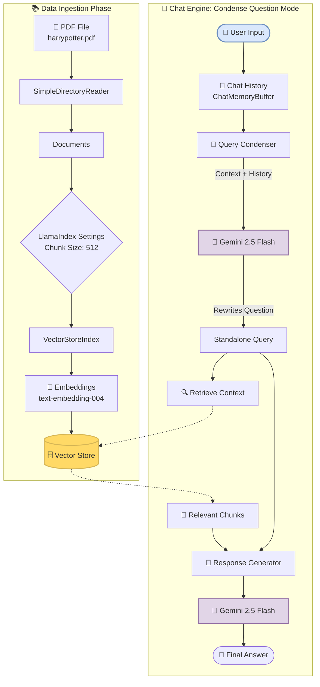

# HARRY POTTER RAG CHATBOT 

A Retrieval-Augmented Generation (RAG) chatbot built with **LlamaIndex** and the **Gemini API** that allows you to ask questions based on the entire Harry Potter book collection.

## Features

* **RAG System:** Answers questions using only the information contained within the `harrypotter.pdf` document.
* **Contextual Chat:** Maintains conversation history for follow-up questions using the `gemini-2.5-flash` model.
* **Professional Setup:** Uses a `.env` file for secure API key management.

## Setup & Installation

## Prerequisites
1.  **Python 3.9+**
2.  A **Gemini API Key** (Get one from [Google AI Studio](https://makersuite.google.com/app/apikey))

## Steps 
1.  **Clone the Repository**
    git clone [your-repo-link]
    cd harry-potter-rag-chatbot
    
2.  **Install Dependencies**
    pip install -r requirements.txt

3.  **Set Up Data and API Key**
    * Create a folder named `data/` and place your `harrypotter.pdf` file inside it.
    * Create a file named **`.env`** in the root directory and add your API key:
        
# .env
    GEMINI_API_KEY="YOUR_API_KEY_HERE"
        

## Usage
Run the main script from your terminal:
python chatbot.py

The chatbot will initialize, load the document, and then prompt you for questions. Type quit to exit.

